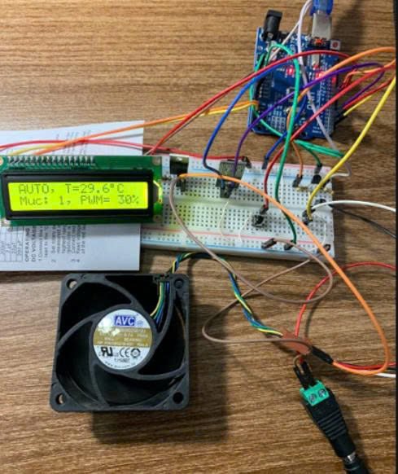
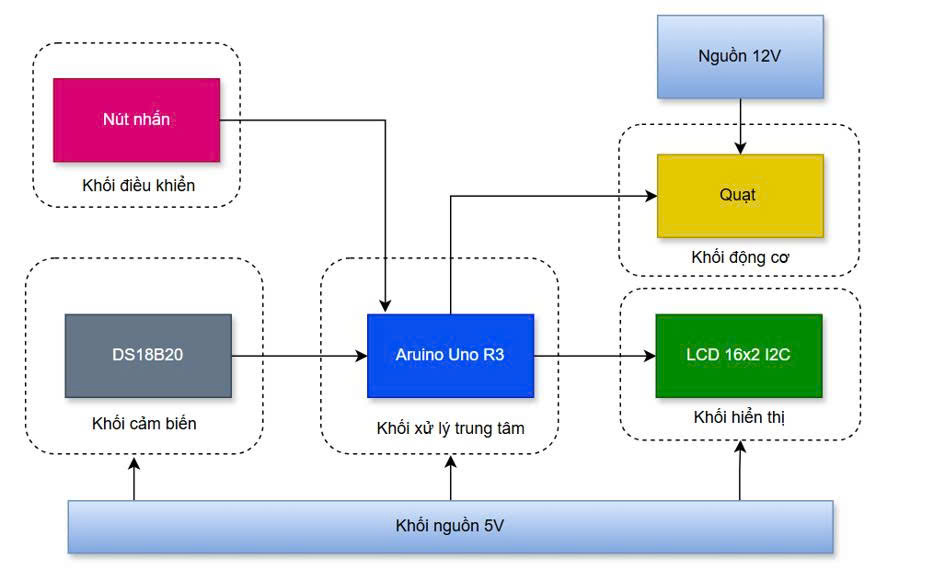
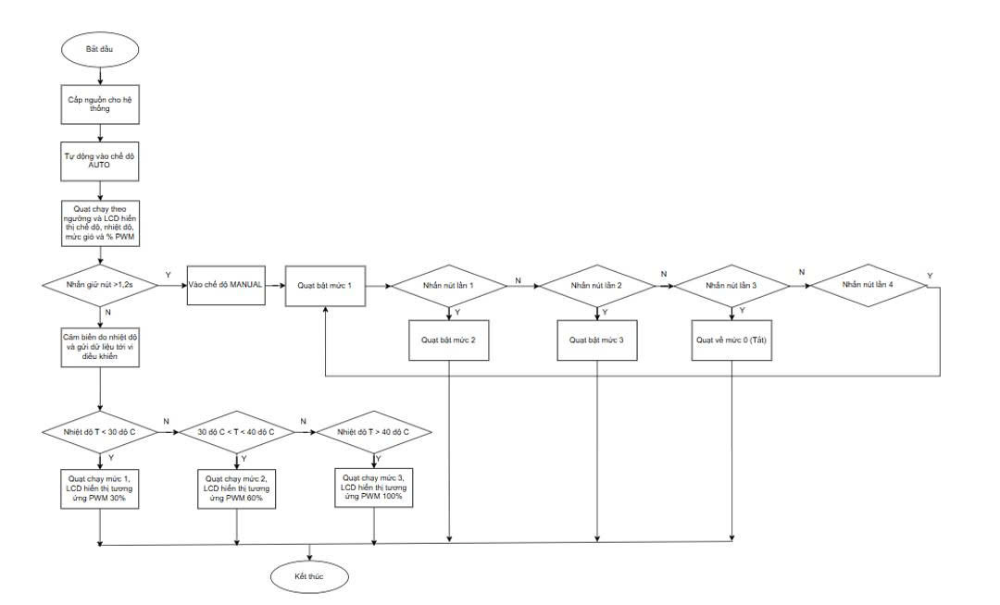
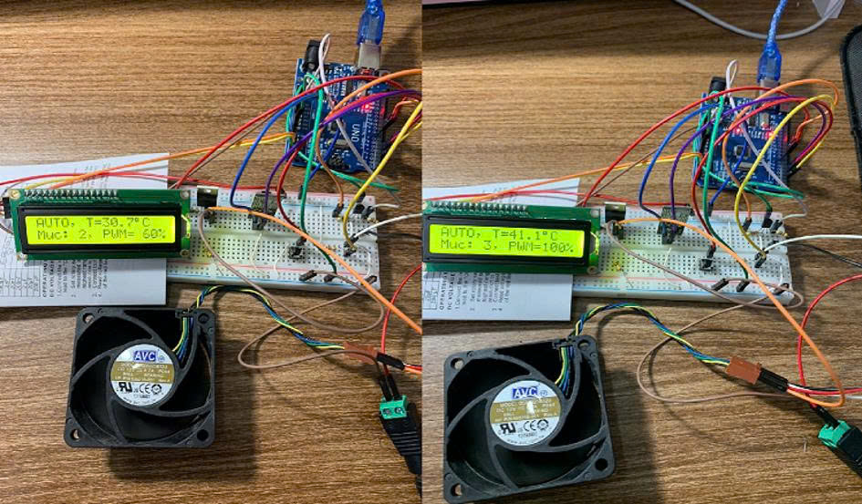
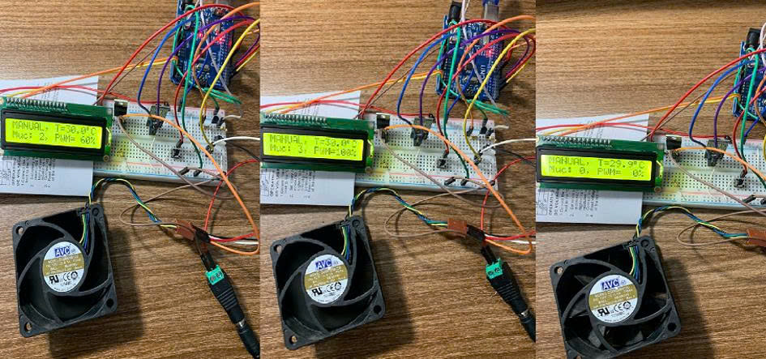

# Embedded Smart Ventilator Controller

[](https://github.com)
[](https://github.com)
[](https://github.com)
[](LICENSE)

An embedded smart ventilator system that automatically adjusts fan speed according to ambient temperature using an Arduino Uno and a DS18B20 temperature sensor. The system supports both **Automatic** and **Manual** operating modes, providing efficient cooling through real-time PWM control.

---

<p align="center">
  
  <br>
  <em>Figure 1: Hardware prototype of the Embedded Smart Ventilator Controller</em>
</p>

---

## Description

Conventional cooling systems usually operate at a fixed fan speed or require manual adjustment, resulting in unnecessary power consumption and excessive noise.

The **Embedded Smart Ventilator Controller** improves cooling efficiency by continuously monitoring ambient temperature and automatically regulating the speed of a 4-wire PWM cooling fan.

- **Automatic Mode:** Fan speed is adjusted automatically based on predefined temperature thresholds.
- **Manual Mode:** Users can switch between different fan levels using a single push button.
- **Real-Time Monitoring:** Temperature, operating mode, fan level, and PWM duty cycle are displayed on the LCD1602 I2C display.

The project demonstrates embedded firmware development involving sensor acquisition, PWM generation, real-time control algorithms, and human-machine interaction.

---

## Key Features

- Automatic temperature-based fan control
- Manual fan speed selection
- 25 kHz PWM generation for 4-wire cooling fans
- DS18B20 digital temperature sensing
- LCD1602 I2C real-time monitoring
- Hysteresis algorithm for stable fan control
- Smooth PWM transition (Slew Rate)
- Fan kick-start mechanism
- Quiet and energy-efficient operation

---

## System Architecture

```text
        DS18B20 Temperature Sensor
                  │
                  ▼
           Arduino Uno R3
                  │
      ┌───────────┼────────────┐
      ▼           ▼            ▼
 LCD1602      Push Button   PWM Driver
                                  │
                                  ▼
                          4-Wire PWM Fan
```

---

<p align="center">
  
  <br>
  <em>Figure 2: System block diagram of the Embedded Smart Ventilator Controller</em>
</p>

---

## Control Algorithm

<p align="center">
  
  <br>
  <em>Figure 3: Software flowchart of the automatic and manual control algorithm</em>
</p>

---

## Automatic Mode

<p align="center">
  
  <br>
  <em>Figure 4: Automatic fan speed adjustment based on ambient temperature</em>
</p>

In Automatic Mode, the controller continuously reads the ambient temperature from the DS18B20 sensor and automatically selects one of three fan levels according to predefined thresholds:

- **Temperature < 30°C** → Level 1 (30% PWM)
- **30°C – 40°C** → Level 2 (60% PWM)
- **Temperature > 40°C** → Level 3 (100% PWM)

A hysteresis algorithm prevents frequent fan speed switching when the measured temperature fluctuates near threshold values.

---

## Manual Mode

<p align="center">
  
  <br>
  <em>Figure 5: Manual fan speed selection using a push button</em>
</p>

Manual Mode allows users to directly control the cooling fan without relying on temperature measurements.

Each button press cycles through the following sequence:

```
OFF → Level 1 → Level 2 → Level 3 → OFF
```

The LCD continuously displays the selected operating mode, fan level, current temperature, and PWM duty cycle.

---

## Applications

- Smart cooling systems
- Electronic cabinet ventilation
- Embedded thermal management
- Industrial cooling systems
- Laboratory equipment cooling
- Educational embedded system projects
